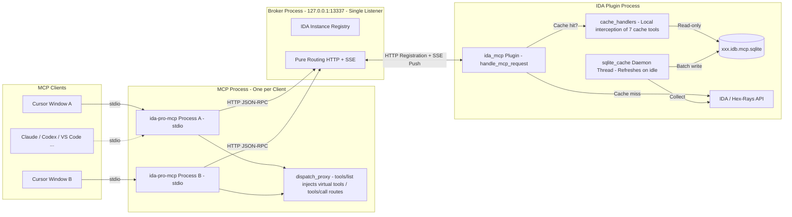
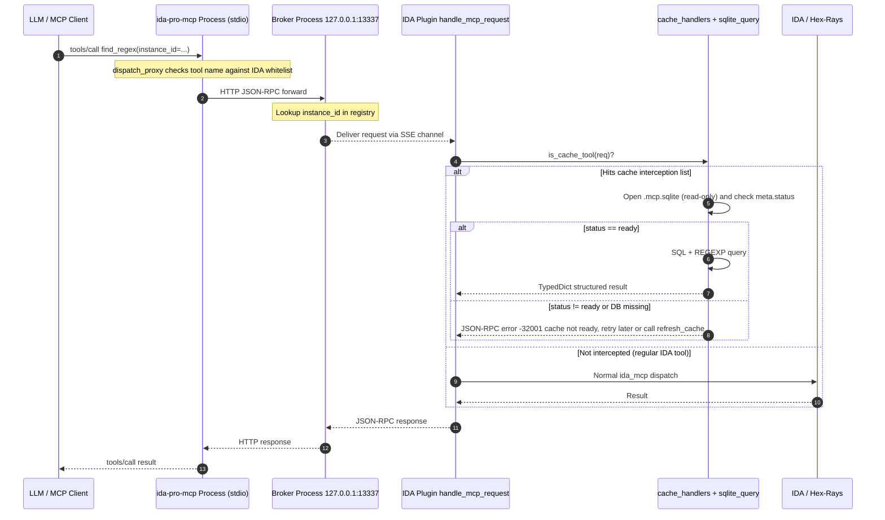
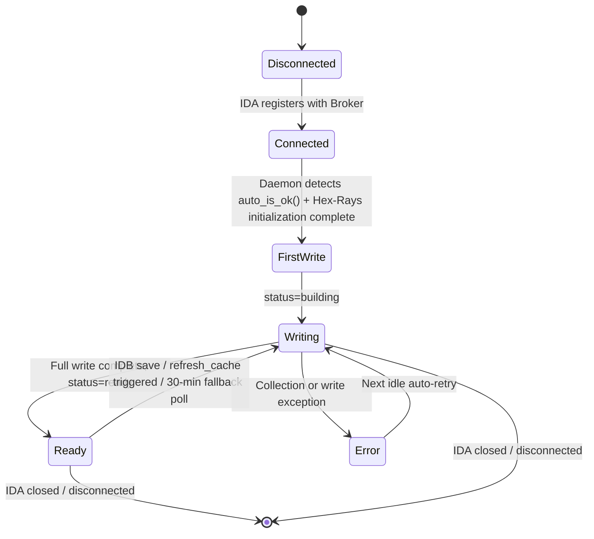

# IDA Pro MCP

> Enhanced version by: **QiuChenly** · [GitHub @QiuChenly](https://github.com/QiuChenly)
>
> Deep refactor based on upstream [mrexodia/ida-pro-mcp](https://github.com/mrexodia/ida-pro-mcp), adding a pure-routing Broker architecture and client-side SQLite static cache interception layer.

An [MCP (Model Context Protocol)](https://modelcontextprotocol.io/introduction) server for IDA Pro that lets LLMs read and write IDA IDBs via structured tool calls, designed for reverse engineering, binary analysis, hook development, and more.

For the original English documentation, see [README.en.md](./README.en.md). This README describes the enhanced Broker architecture and SQLite static cache interception layer built on top of the upstream project.

Example videos and prompts: see [mcp-reversing-dataset](https://github.com/mrexodia/mcp-reversing-dataset).

---

## 1. Highlights (This Enhanced Version vs. Upstream)

- **Pure-routing Broker process**: Listens independently on `127.0.0.1:13337`; IDA instances and all MCP clients interact only with it. Multiple Cursor windows and multiple IDA instances can connect simultaneously without port conflicts.
- **Client-side SQLite static cache (`xxx.idb.mcp.sqlite`)**: The IDA plugin uses a daemon thread during IDA idle time to dump all strings, functions, globals, imports, and cross-references to a SQLite file alongside the IDB.
- **Cache-intercepted tools/call**: 7 tools — `find_regex / entity_query / list_funcs / list_globals / imports / refresh_cache / cache_status` — are **responded to directly from the local SQLite** within the IDA plugin process, completely avoiding the IDA main thread.
- **Strict type protocol**: All new API requests/responses use `TypedDict` (`FindRegexArgs / FindRegexResult / ToolSchema / McpToolCallResult`, etc.), eliminating "does this field exist?" uncertainties.
- **Broker-injected virtual tools**: `refresh_cache` and `cache_status` are appended as virtual `ToolSchema` entries to the `tools/list` results. The model can see and call them directly, but they don't execute in the Broker — they're ultimately routed to the designated IDA instance.
- **idalib headless mode**: Run a pure headless service via `idalib-mcp`, with `--isolated-contexts` for strict per-connection context isolation.

---

## 2. Requirements

- Python 3.11+ (recommended to use `idapyswitch` to switch to the latest Python)
- IDA Pro 8.3+ (9.0+ recommended), **IDA Free is not supported**
- Any standard MCP client: Cursor / Claude / Claude Code / Codex / VS Code / Gemini CLI / Cline, etc.

---

## 3. Installation

```bash
pip uninstall ida-pro-mcp
pip install https://github.com/QiuChenly/ida-pro-mcp-enhancement/archive/refs/heads/main.zip
```

Local development install:

```bash
cd ida-pro-mcp-enhancement && uv venv && uv pip install -e .
```

Configure MCP clients and IDA plugin:

```bash
ida-pro-mcp --install
```

After installation, **fully restart** IDA and your MCP client. Some clients (e.g., Claude Desktop) run in the background — exit them from the system tray. The IDA plugin menu only appears after loading a binary file.

---

## 4. Overall Architecture

The diagram below describes all runtime components and data flows of this enhanced version.



Key points:

- **MCP processes don't bind ports**: Each client window starts its own `ida-pro-mcp` instance (stdio), and they all forward requests to the Broker via HTTP.
- **Broker only routes**: It doesn't read IDBs or SQLite, and has zero business logic. It simply forwards JSON-RPC requests to the corresponding IDA plugin by `instance_id` and relays SSE responses back.
- **SQLite reads and writes happen within the IDA process**: Writes are handled by the daemon thread (triggered on idle); reads are handled by the `handle_mcp_request` interception layer (cache hit queries the DB instead of the IDA API). The Broker process never imports `sqlite_cache / sqlite_query`.

---

## 5. Complete Sequence of a tools/call



When the cache is not ready, it **does not fall back to the live IDA API**. Instead, it reports an error directly to the model with instructions to retry later or call `refresh_cache` first. This is an intentional hard semantic: it prevents the LLM from receiving "half-new, half-old" data in an unknown state, which could lead to incorrect analysis.

---

## 6. SQLite Cache Daemon Thread Lifecycle



- Cache filename is fixed as `<IDB path>.mcp.sqlite`, stored alongside the IDB.
- The `meta` table records `status` (`building / ready`), `last_updated`, etc.
- Uses WAL mode, allowing read-only `file:...?mode=ro` connections to query while writes are in progress (reading the old snapshot).
- `cache_status` queries never throw errors: when the file is missing, it returns `{exists: false, status: "missing"}`.
- **Re-indexing triggers** (any one of these three triggers a full rebuild, which executes during IDA idle):
  1. **IDB save**: Every time IDA saves the database (Ctrl+S or auto-save), the `IDB_Hooks.savebase` callback immediately wakes the daemon thread, ensuring renames, new functions, and other changes are synced in real-time.
  2. **Explicit `refresh_cache` call**: Triggered explicitly by the MCP client, bypasses all checks and directly rebuilds.
  3. **30-minute fallback poll**: On timed wakeup, checks the IDB file mtime. If unchanged since the last rebuild, it skips to avoid unnecessary full scans.

---

## 7. Usage (Broker Mode)

When using multiple Cursor windows or multiple IDA instances, make sure to **start the Broker first**, then start the clients.

```bash
# 1. Start the Broker first (keep a terminal open)
uv run ida-pro-mcp --broker
# Or with a custom port
uv run ida-pro-mcp --broker --port 13337

# 2. Start Cursor/Claude/VS Code etc. — they will launch
#    their own ida-pro-mcp processes via stdio and send
#    requests to the Broker above

# 3. Open IDA, load a binary, press Ctrl+Alt+M to connect to the Broker
```

### Multi-Instance Mode

To analyze multiple binaries simultaneously: open multiple IDA instances and press Ctrl+Alt+M in each to connect to the Broker.

| Tool | Description |
|------|-------------|
| `instance_list()` | List all connected IDA instances (`instance_id, name, binary_path, idb_path, base_addr`) |
| `instance_info(instance_id)` | Get detailed info for a specific instance |

This enhanced version no longer provides implicit "current active instance" state, nor `instance_switch / instance_current`. Every business tool call (e.g., `decompile`, `xrefs_to`, `find_regex`, etc.) **must** explicitly include `instance_id` in the `arguments`, and the Broker will precisely route to the target IDA. This prevents multiple MCP clients sharing the same Broker from stepping on each other's implicit state.

---

## 8. Command-Line Arguments

| Argument | Description |
|----------|-------------|
| `--install` | Install IDA plugin + configure all MCP clients |
| `--uninstall` | Uninstall IDA plugin + remove MCP client configs |
| `--unsafe` | Enable unsafe tools like debugger (`dbg_*`) |
| `--broker` | Start Broker only (HTTP, no stdio) |
| `--broker-url URL` | Broker address for the current MCP process to connect to, default `http://127.0.0.1:13337` |
| `--port PORT` | Broker listen port, default 13337 |
| `--transport URL` | Attach directly to an upstream MCP transport via SSE, e.g., `http://127.0.0.1:8744/sse` |
| `--config` | Print current MCP configuration |

The Broker address can also be set via environment variable:

```bash
IDA_MCP_BROKER_URL=http://127.0.0.1:13337 ida-pro-mcp
```

### Enabling Debugger Tools

```json
{
  "mcpServers": {
    "ida-pro-mcp": {
      "command": "uv",
      "args": ["run", "ida-pro-mcp", "--unsafe"]
    }
  }
}
```

---

## 9. Cache-Related Tools

| Tool | Semantics | Error Behavior |
|------|-----------|----------------|
| `find_regex(instance_id, pattern, limit?, offset?, include_xrefs?)` | Regex search the string table, with xrefs | Throws `-32001` when status != ready |
| `entity_query(instance_id, kind, name_pattern?, segment?, ...)` | Unified entity query, kind ∈ `strings / functions / globals / imports` | Same as above |
| `list_funcs(instance_id, name_pattern?, ..., include_xrefs?)` | Function list, optionally with xrefs | Same as above |
| `list_globals(instance_id, name_pattern?, ...)` | Global variables list | Same as above |
| `imports(instance_id, name_pattern?, module_pattern?, ...)` | Import table list | Same as above |
| `refresh_cache(instance_id)` | Wake the target IDA's cache daemon thread, returns immediately with `{triggered, idb_path}` | Never throws |
| `cache_status(instance_id)` | Query whether the cache file exists, `status`, table counts | Returns `{exists: false, status: "missing"}` when file doesn't exist |

Error code conventions:
- `-32001`: Cache not ready / file missing
- `-32000`: No `instance_id` provided or no active IDA instances
- `-32602`: Parameter error (e.g., invalid `entity_query.kind`)
- `-32603`: SQLite query internal exception

---

## 10. Non-Cache Tools Overview

The following tools still go through normal IDA API dispatch, executed on the IDA main thread via `@idasync` in the plugin process.

All tool names listed below are the actual registered names in the codebase (defined by `@tool` in the `api_*.py` files). If there are discrepancies, the source code is authoritative.

### Core Queries
- `lookup_funcs(queries)` — Look up functions by address or name
- `int_convert(inputs)` — Convert between decimal / hex / bytes / ASCII / binary
- `decompile(addr)` / `disasm(addr)` — Decompile / disassemble
- `xrefs_to(addrs)` / `xref_query(queries)` / `xrefs_to_field(queries)` — Cross-references
- `callees(addrs)` — Called functions
- `func_profile(queries)` — Quick function profile (prologue / return / basic block summary, etc.)

### Modification
- `set_comments(items)` — Write comments in both disassembly and pseudocode views
- `patch_asm(items)` — Assembly-level patches
- `declare_type(decls)` — Declare C types in the IDB local type library
- `define_func(items)` / `define_code(items)` / `undefine(items)` — Function / code definition control

### Memory Reading
- `get_bytes(addrs)` / `get_int(queries)` / `get_string(addrs)` / `get_global_value(queries)`

### Stack Frames
- `stack_frame(addrs)` / `declare_stack(items)` / `delete_stack(items)`

### Structures
- `read_struct(queries)` / `search_structs(filter)`

### Advanced Analysis
- `py_eval(code)` — Execute arbitrary Python in the IDA context
- `analyze_function(addr, ...)` — Deep single-function analysis (decompile + assembly + xrefs + call relationships + basic blocks + constants + strings)
- `analyze_batch(queries)` — Batch version of `analyze_function`
- `analyze_component(...)` — Component-level analysis rooted at an entry point (call tree + data flow summary)
- `diff_before_after(...)` — Before/after snapshot diff analysis
- `trace_data_flow(...)` — Data flow tracing

### Pattern Search
- `find_bytes(patterns)` — Byte pattern search (supports `48 8B ?? ??`)
- `insn_query(queries)` — Instruction sequence query by mnemonic / operand semantics
- `find(type, targets)` — Unified search for immediates / strings / data and code references

### Control Flow / Types / Exports / Graphs
- `basic_blocks(addrs)`
- `set_type(edits)` / `infer_types(addrs)`
- `export_funcs(addrs, format)` — Export as `json / c_header / prototypes`
- `callgraph(roots, max_depth)`

### Batch Operations
- `rename(batch)` — Unified batch rename for functions / globals / locals / stack variables
- `patch(patches)` — Batch byte patching
- `put_int(items)` — Batch integer writing

### Debugger (requires `--unsafe`)
- Control: `dbg_start / dbg_exit / dbg_continue / dbg_run_to / dbg_step_into / dbg_step_over`
- Breakpoints: `dbg_bps / dbg_add_bp / dbg_delete_bp / dbg_toggle_bp`
- Registers: `dbg_regs / dbg_regs_all / dbg_gpregs / dbg_regs_named / dbg_regs_remote / dbg_gpregs_remote / dbg_regs_named_remote`
- Stack / Memory: `dbg_stacktrace / dbg_read / dbg_write`

---

## 11. MCP Resources (Read-Only State)

`ida://` resources exposed per the MCP specification:

- `ida://idb/metadata` — IDB metadata (path, architecture, base address, hash)
- `ida://idb/segments` — Segments and permissions
- `ida://idb/entrypoints` — Entry points (main / TLS callbacks, etc.)
- `ida://cursor` — Current cursor position + containing function
- `ida://selection` — Current selection
- `ida://types` — Local types
- `ida://structs` — All structures / unions
- `ida://struct/{name}` — Structure fields
- `ida://import/{name}` — Look up import by name
- `ida://export/{name}` — Look up export by name
- `ida://xrefs/from/{addr}` — Cross-references from an address

---

## 12. SSE Transport & Headless idalib

Serve directly via SSE transport:

```bash
uv run ida-pro-mcp --transport http://127.0.0.1:8744/sse
```

Headless mode (requires [`idalib`](https://docs.hex-rays.com/user-guide/idalib)):

```bash
uv run idalib-mcp --host 127.0.0.1 --port 8745 path/to/executable
# Strict per-connection context isolation
uv run idalib-mcp --isolated-contexts --host 127.0.0.1 --port 8745 path/to/executable
```

`--isolated-contexts` semantics:

- Each transport context (`/mcp`'s `Mcp-Session-Id`, `/sse`'s `session`, stdio's `stdio:default`) has its own independent session binding.
- Unbound contexts calling IDB-dependent tools will fail immediately, preventing cross-agent misoperations.
- When multiple agents want to share the same session, they can explicitly join via `idalib_switch(session_id)`.

Context management tools:

- `idalib_open(input_path, ...)` — Open and bind
- `idalib_switch(session_id)` — Switch binding
- `idalib_current()` — Query current binding
- `idalib_unbind()` — Unbind
- `idalib_list()` — List sessions, with `is_active / is_current_context / bound_contexts`

---

## 13. Prompt Engineering Tips

LLMs are prone to errors with base conversion, math calculations, and obfuscated code. Make sure to:

- Explicitly require using the `int_convert` tool for base conversions — don't let the model calculate manually.
- Use [math-mcp](https://github.com/EthanHenrickson/math-mcp) for complex calculations when needed.
- Preprocess obfuscated code before handing it to the LLM: string decryption, import hashing, control flow flattening, code encryption, anti-decompilation tricks.
- Use Lumina or FLIRT to resolve open-source libraries and C++ STL first.

A minimal prompt suitable for crackme scenarios:

```md
Your task is to analyze a crackme in IDA Pro. You can use MCP tools to gather information. Overall strategy:

- Start by reviewing the decompiled and disassembled code using decompile / disasm
- Add comments to suspicious code, then rename variables, parameters, and functions to descriptive names
- Fix types when necessary (especially pointers and arrays)
- Never do base conversions yourself — always use int_convert
- Don't brute-force — derive conclusions only from disassembly and simple Python scripts
- After analysis, write a report.md, and present the discovered password to the user for confirmation
```

---

## 14. FAQ

**Q: IDA plugin connection failed / `instance_list` is empty?**

1. Start the Broker separately first: `uv run ida-pro-mcp --broker` (keep it running)
2. Then start Cursor / Claude / VS Code, etc.
3. In IDA, press Ctrl+Alt+M to connect
4. If there's a port conflict: `ida-pro-mcp --broker --port 13338`, and make sure the IDA plugin and MCP client `broker-url` match

**Q: Calling `find_regex / list_funcs` etc. returns `-32001`?**

This means the local `.mcp.sqlite` hasn't finished building yet — this is normal during initialization. You can:

- Call `cache_status(instance_id=...)` to check `status` and table counts.
- Call `refresh_cache(instance_id=...)` to manually wake the cache daemon thread.
- Wait a moment and retry.

**Q: Where is the cache file? Can I delete it?**

Right next to the IDB: `<IDB path>.mcp.sqlite` (along with `.mcp.sqlite-wal / -shm` in the same directory). You can delete it anytime; it will be rebuilt next time IDA is idle.

**Q: `uv pip install -e .` shows "Failed to clone files; falling back to full copy"?**

This is just a uv warning (reflink failed across volumes) — the build actually succeeded. This project's `pyproject.toml` includes `[tool.uv] link-mode = "copy"` to suppress this warning.

**Q: Does it support IDA Free?**

No. IDA Free doesn't have the plugin API.

**Q: Pressing G to jump fails?**

Update to the latest version and restart IDA:

```bash
uv pip install -e .
```

---

## 15. Development

Core implementation locations:

- `src/ida_pro_mcp/server.py` — Main MCP server entry point (stdio / broker dual-mode dispatch)
- `src/ida_pro_mcp/idalib_server.py` — idalib headless server
- `src/ida_pro_mcp/ida_mcp.py` — IDA plugin entry point and `handle_mcp_request`
- `src/ida_pro_mcp/ida_mcp/api_*.py` — All business tools and resources (IDA-side only)
- `src/ida_pro_mcp/broker/server.py` — Broker HTTP + registry + SSE
- `src/ida_pro_mcp/broker/manager.py` — `dispatch_proxy` routing + virtual tool injection
- `src/ida_pro_mcp/broker/sqlite_cache.py` — Plugin-side idle daemon + writes
- `src/ida_pro_mcp/broker/sqlite_query.py` — Plugin-side read-only queries (strongly typed)
- `src/ida_pro_mcp/broker/cache_handlers.py` — `tools/call` local cache interception
- `src/ida_pro_mcp/broker/cache_types.py` — All protocol `TypedDict`s (`JsonRpcRequest / Response / Error / ToolSchema / *Args / *Result`)

To add a new tool:

1. Write a `@tool` + `@idasync` function in the corresponding `api_*.py` with complete Python type annotations;
2. Use `Annotated[...]` for parameter descriptions; the function docstring becomes the tool description exposed to the model;
3. The MCP server automatically scans `api_*.py` files and registers them — no manual schema changes needed.

Running tests:

```bash
uv run ida-mcp-test tests/crackme03.elf -q
uv run ida-mcp-test tests/typed_fixture.elf -q
```

MCP inspector debugging:

```bash
uv run mcp dev src/ida_pro_mcp/server.py
```

Coverage:

```bash
uv run coverage erase
uv run coverage run -m ida_pro_mcp.test tests/crackme03.elf -q
uv run coverage run --append -m ida_pro_mcp.test tests/typed_fixture.elf -q
uv run coverage report --show-missing
```

---

## 16. Comparison with Other IDA MCP Implementations

Several IDA Pro MCP implementations already exist. This repository builds on the upstream [mrexodia/ida-pro-mcp](https://github.com/mrexodia/ida-pro-mcp) with two key improvements:

- Made the Broker a pure router, solving multi-client concurrency issues;
- Introduced client-side SQLite static caching, moving high-frequency read-only queries off the IDA main thread so that LLMs in large-scale analysis scenarios are no longer bottlenecked by IDA API round-trips.

Other implementations (for comparison):

- https://github.com/mrexodia/ida-pro-mcp — Upstream
- https://github.com/taida957789/ida-mcp-server-plugin — SSE only, requires IDAPython dependencies
- https://github.com/fdrechsler/mcp-server-idapro — TypeScript, requires extensive boilerplate for new features
- https://github.com/MxIris-Reverse-Engineering/ida-mcp-server — Custom socket, heavy boilerplate

PRs welcome.

---

## 17. License

See [LICENSE](./LICENSE).

---

## Attribution

- **Enhanced version maintainer**: [QiuChenly](https://github.com/QiuChenly)
- **Original upstream author**: [mrexodia](https://github.com/mrexodia)

This project was enhanced by QiuChenly on top of the upstream `ida-pro-mcp`, implementing the Broker routing architecture, SQLite static cache interception, and strict type protocol features. If used in papers, blog posts, or tools, please credit both the upstream author and the enhanced version author.
